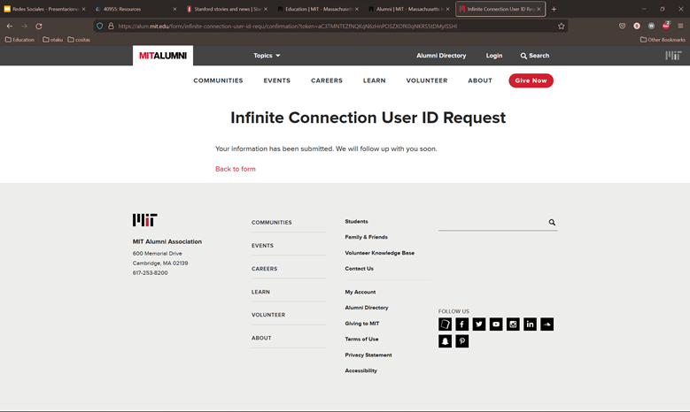

## 8 Golden Rules of Interface Design

A good interface should be designed to avoid errors as much as possible. However, if something goes wrong, your system should make it easy for users to understand and resolve 
the problem. Simple ways to deal with errors include displaying clear error notifications and descriptive hints to resolve the problem.
To achieve this there are 8 rules that must be applied in every interface.

The two university websites we analyzed were:
[Stanford University](stanford.edu) | 
[MIT](mit.edu)

Those rules are:

## 1. Strive for consistency.
### By utilizing familiar icons, colors, menu hierarchy, call-to-actions, and user flows when designing similar situations and sequence of actions. Both websites are consistent in the design and information layout throughout all the main sections they have.
 
## 2. Seek universal usability.
### With increased use comes the demand for quicker methods of completing tasks, such as keyboard shortcuts for copying and pasting in Windows or Mac. The Stanford University website has three different shortcuts for students to use. However, we did not find any in the MIT website.

## 3. Offer informative feedback.
### The user should know where they are at and what is going on at all times. For every action there should be appropriate, human-readable feedback within a reasonable amount of time. We can find in both websites informative feedback on how to create an account or log in to an existing one.

## 4. Design dialogs to yield closure.
### When finishing a process or procedure, users should get an output informing him what the status of the process is (completed, failed...). Both websites properly inform you when a process, such as requesting a user ID, is complete.

## 5. Prevent errors.
### Systems should be designed to avoid as many errors as possible, but some are unavoidable. Therefore, users should be provided with simple, intuitive step-by-step instructions to solve the problem. When entering the wrong information in forms, both websites let us know that we must enter the correct information.

## 6. Permit easy reversal of actions.
### Designers should aim to offer users obvious ways to reverse their actions. These reversals should be permitted at various points. We did not find any possible way of reversing a user ID request or any other kind of process.
## 7. Keep users in control.
### Allow your users to be the initiators of actions. Give users the sense that they are in full control of events occurring in the digital space. We felt like we had little to no control over anything when visiting the websites. There were no possible customizations to make the appearance or usage more appealing to us.
## 8. Reduce short-term memory load.
### Human attention is limited. Therefore, interfaces should be as simple as possible with proper information hierarchy, and choosing recognition over recall. When, for example requesting a password change, we only have to enter our institutional email and then click on a link sent to us to that email account.

